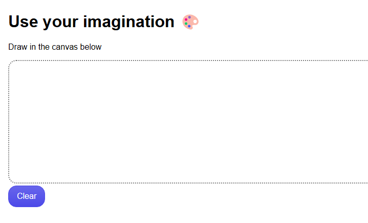
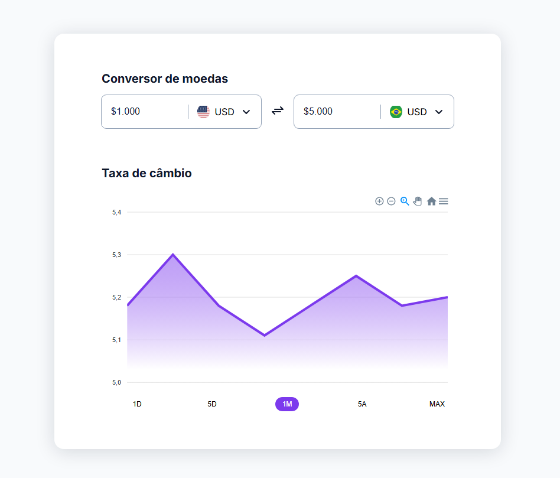
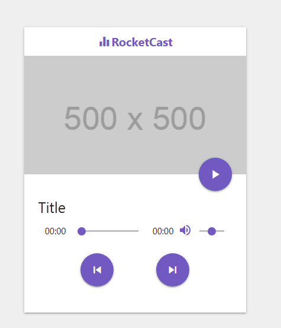

### Html

<table>
    <thead>
        <tr>
            <th align="center">
                 
                

                    <small>#</small>
                

            </th>
            <th align="center">
                 
                
 
                    <small>
                        NAME
                    </small>
                

            </th>
            <th align="center">
                
                
 
                    <small>
                    PREVIEW
                    </small>
                

            </th>
        </tr>
    </thead>
    <tbody>
        <tr>
            <td>01</td>
            <td><a href="ReactiveWebStream">paint</a></td>
            <td align="center">
            </td>
        </tr>
         <tr>
            <td>02</td>
            <td><a href="02">Conversor de moedas</a></td>
            <td align="center">
            </td>
        </tr>
         <tr>
            <td>03</td>
            <td><a href="html-js-audio">Music Player</a></td>
            <td align="center">
            </td>
        </tr>
    </tbody>
</table>

